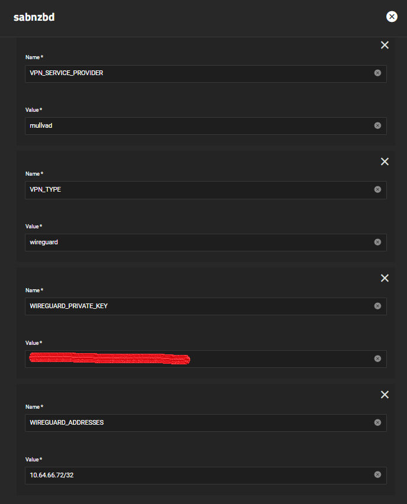

# Gluetun VPN Add-on Setup Guide

Basic setup of the [TrueCharts](https://www.truecharts.org) [Gluetun](https://github.com/qdm12/gluetun/) VPN addon

## Prerequisites

- Anything migrated to the new common chart that features Gluetun
- Ideally a VPN provider supported by Gluetun, check the [Wiki](https://github.com/qdm12/gluetun/wiki) on the [Gluetun](https://github.com/qdm12/gluetun/) site for more info

## Gluetun VPN Addon Setup

- Install app as per usual and scroll down the to the `Addons` section
- Click on `VPN` and select `Gluetun`

`Gluetun` works with Environment Variables so we need to configure them below. I've split them up to the `TrueCharts` specific ones (see above) and the `VPN Provider` specific ones (see blow)

- Truecharts Specific Env Vars (that worked for me)

    - `FIREWALL_OUTBOUND_SUBNETS`: Enter `172.16.0.0/12` for Kubernetes and then your local lan IP (eg `192.168.88.0/24` for me)
    - `DOT`: Enter `off`
    - `DNS_KEEP_NAMESERVER`: `on`

-  OpenVPN Provider specific Env Vars

- All providers will generally need `VPN_SERVICE_PROVIDER` and `VPN_TYPE`, for me it's `Windscribe` and `openvpn` but I could easily choose `Wireguard`
- Scroll to the [Gluetun Wiki](https://github.com/qdm12/gluetun/wiki) and find your specific provider and enter their info, eg [Windscribe Wiki Page](
https://github.com/qdm12/gluetun/wiki/Windscribe)

- Wireguard Provider specific Env Vars

- The example here uses Mulvad. There is excellent information on creating your Mulvad configuration for Gluetun here (https://github.com/qdm12/gluetun/wiki/Mullvad).
- "VPN_SERVICE_PROVIDER" will be "mullvad" and VPN_TYPE is "wireguard". The WIREGUARD_PRIVATE_KEY and WIREGUARD_ADDRESSES will be stored in your configuration file (e.g. us-###-wg-###.conf) and can be retrived from there. Note the WIREGUARD_ADDRESSES is in CIDR notation (e.g. /32 at end of IP address).

## Verify it works

Easiest way to verify after it deploys (the app will fail if your credentials don't work) for me is using `qbittorrent` since the network page shows the interfaces can be shown quickly (or check the logs)

